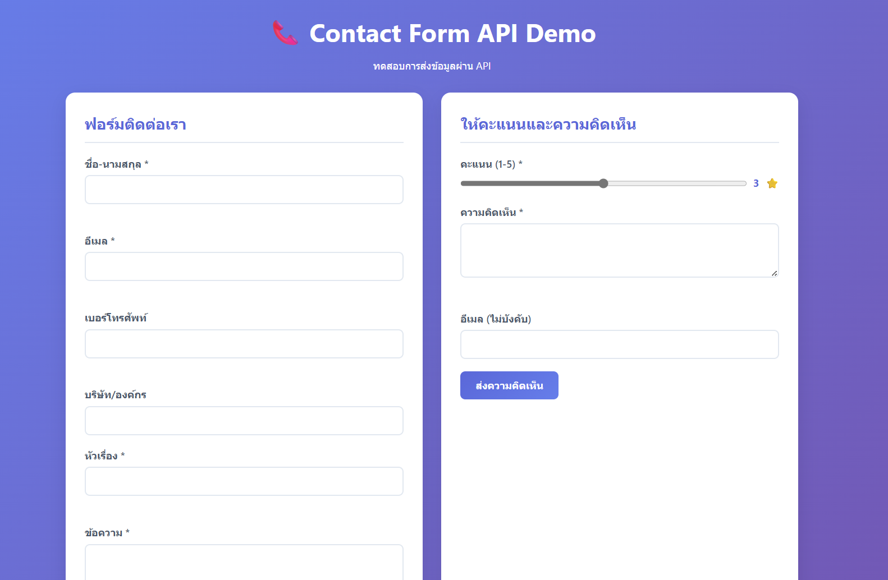
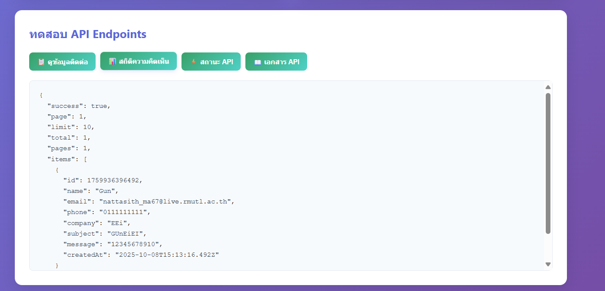

# 💬 Lab 4.3: Contact Form API

โดยเราจะสร้าง Contact Form API พร้อมระบบ **validation**, **file storage**, และ **frontend**  
เพื่อทดสอบ API ที่ใช้ **Express.js** และเก็บข้อมูลในรูปแบบ **JSON file**  
นักศึกษาจะได้ฝึกใช้งานการเชื่อมต่อ frontend ↔ backend ผ่าน REST API

---

## 🚀 การติดตั้งและรันโปรเจค

### 📦 ติดตั้ง dependencies

```bash
npm install
▶️ รันโปรเจค (โหมดปกติ)
bash
คัดลอกโค้ด
npm start
🔁 หรือใช้ nodemon (โหมดพัฒนา)
bash
คัดลอกโค้ด
npm run dev
🧪 Testing Sections


---


✅ 1. Contact Form Validation
ตรวจสอบความถูกต้องของทุก Field ก่อนบันทึก เช่น:

ต้องกรอก ชื่อ / อีเมล / หัวข้อ / ข้อความ

ตรวจสอบรูปแบบอีเมล (example@email.com)

ตรวจสอบเบอร์โทรศัพท์ให้ถูกต้อง (^[0-9]{9,10}$)

ตัวอย่างการแสดงผลเมื่อกรอกไม่ถูกต้อง

เบอร์โทรศัพท์ไม่ถูกต้อง


---


✅ 2. Feedback Form
แบบฟอร์มให้ผู้ใช้ให้คะแนนและแสดงความคิดเห็น

เมื่อส่งข้อมูลแล้ว ระบบจะบันทึกลงใน data/feedback.json

และแสดงข้อความยืนยันผลลัพธ์

ตัวอย่างผลลัพธ์ที่สำเร็จ

<span style="color:green;">✅ ส่งข้อความติดต่อสำเร็จ! ขอบคุณที่ติดต่อเรา</span>


---


📁 โครงสร้างโปรเจค
pgsql
คัดลอกโค้ด
lab-4-3-contact-form/
├── package.json
├── server.js
├── data/
│   ├── contacts.json
│   └── feedback.json
├── middleware/
│   ├── validation.js
│   └── fileManager.js
├── routes/
│   ├── contact.js
│   └── feedback.js
└── public/
    ├── index.html
    ├── style.css
    └── script.js


---


📘 API Endpoints
Method	Endpoint	Description
POST	/api/contact	ส่งข้อมูลติดต่อ
GET	/api/contact	ดึงข้อมูลติดต่อทั้งหมด (รองรับ pagination)
POST	/api/feedback	ส่งความคิดเห็นและคะแนน
GET	/api/feedback/stats	ดูสถิติการให้คะแนน
GET	/api/status	ดูสถานะของ API และจำนวนข้อมูลในไฟล์
GET	/api/docs	เอกสาร API ทั้งหมด


---


🧩 ฟังก์ชันที่นักศึกษาต้องพัฒนา (30%)
ส่วน	รายละเอียด
✅ validation.js	เพิ่มการตรวจสอบข้อมูลทุก field
✅ fileManager.js	เพิ่ม ID, timestamp และ getFileStats()
✅ routes/contact.js	เพิ่ม POST / GET พร้อม pagination
✅ routes/feedback.js	เพิ่ม POST / GET /stats
✅ script.js	เพิ่ม realtime validation, feedback submit, API test
✅ server.js	เชื่อมต่อ route และสร้าง /api/status


---


<h3>📸 ภาพรวมการทำงาน</h3>

    
  


---

🎥 วิดีโอสาธิตการทำงาน

คลิกที่ภาพด้านล่างเพื่อดูวิดีโอสาธิตบน YouTube 👇

[](https://youtu.be/ylPN1qb6dwM)


---


👨‍💻 ผู้จัดทำ
ชื่อ-นามสกุล: ณัฐสิทธิ์ มะโนชัย
รหัสนักศึกษา: 67543210056-7
รายวิชา: Web Application Development (ENGSE Lab 4.3)
```
